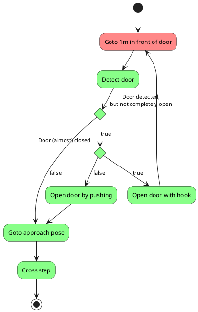

# Door crossing procedure

```puml
@startuml
skinparam activity {
  BackgroundColor #88FF88
  BackgroundColor<< NotImplemented >> #FF8888
}

(*) --> "Goto 1m in front of door" as approach_front << NotImplemented >>
--> "Detect door"
if "Door detected,\nbut not completely open" then  
  -->[true] if "Door (almost) closed" then
    --> [true] "Open door with hook"
    --> approach_front
  else
    --> [false] "Open door by pushing" 
    --> "Goto approach pose" as approach
  endif
else
  --> [false] approach
endif 

--> "Cross step"
--> (*)
@enduml
```
